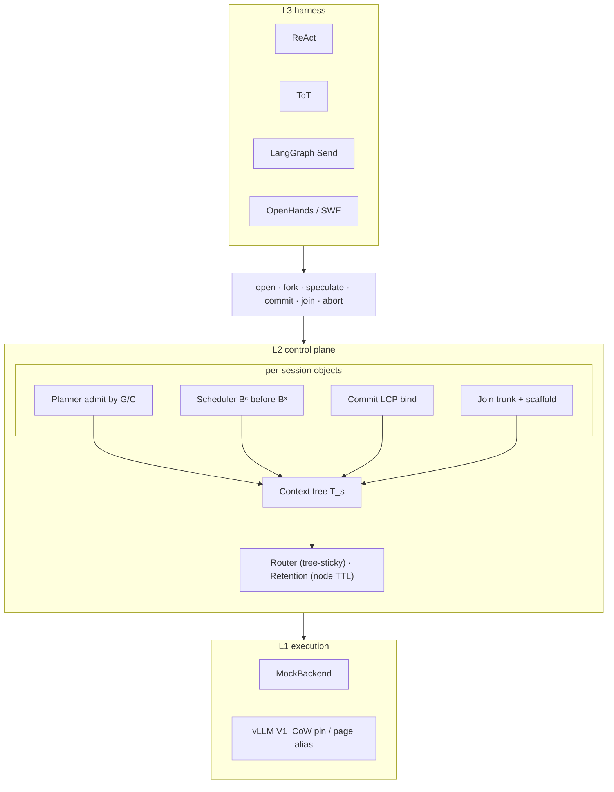
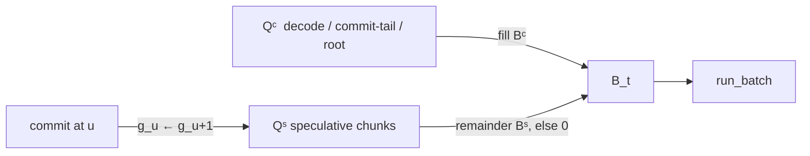

# ForkServe Architecture

Control-plane specification. The vLLM worker/kernel contract is [`FORKSERVE_VLLM_DESIGN.md`](FORKSERVE_VLLM_DESIGN.md). Cross-session hashing is [`HASH_FORKSERVE.md`](HASH_FORKSERVE.md).

## 1. Problem

An agentic step is a tree of token sequences, not a linear prompt. A trunk \(x\) of length \(L\) is shared by \(k\) children with residuals \(\ell_i\). After a winner \(\star\) is bound, only \(L+\ell_\star\) remains live.

| Scheme | When sharing is discovered | Live KV (distinct rows) |
|---|---|---|
| Recompute | never | \(kL+\sum_i\ell_i\) |
| APC / radix | after tokens exist; full blocks only | \(L+\sum_i\ell_i\) on hit; \(kL+\sum_i\ell_i\) on first fan-out |
| ForkServe | at `fork`, before the residual exists | \(L+\sum_i\ell_i\) in flight; \(L+\ell_\star\) after abort |

Prefill work matches APC on a warmed, aligned trunk. Storage after abort does not: APC retains hashed residuals until LRU eviction; ForkServe decrefs them.

Speculative KV is an **input-side** cache of the *next* branch. It is never sampled and never fed back. `commit` is the only verb on the critical path of user-visible tokens.

## 2. Model

Per session \(s\), a rooted tree \(T_s=(V,E)\). Node \(v\in V\):

| Symbol | Meaning |
|---|---|
| \(x_v\) | token sequence at \(v\) |
| \(\pi(v)\) | parent; \(\pi(r)=\bot\) for root \(r\) |
| \(\rho_v\) | residual: \(x_v[\,|x_{\pi(v)}|\,:]\) |
| \(m_v\) | mode \(\in\{\mathrm{Spec},\mathrm{Commit},\mathrm{Idle},\mathrm{Dead}\}\) |
| \(g_v\) | generation; incremented on commit at \(v\) |
| \(\sigma_v\) | logical page table (parent alias + private pages) |
| \(b\) | bytes of KV per token (all layers, one sequence) |
| \(P\) | page size (tokens) |
| \(B_t\) | batched-token budget on tick \(t\) |

**Invariants.**

1. **Prefix.** \(\forall v\neq r:\; x_{\pi(v)}\preceq x_v\).
2. **Spine.** Exactly one committed child per node, except during an in-flight `join`.
3. **Isolation.** Spec nodes are invisible to the sampler. Decode at a Commit node attends only to \(\mathrm{KV}(x_v)\) for the committed sequence.
4. **Liveness.** Physical-page `ref` equals the number of non-Dead nodes that map the page.
5. **Generation.** Commit at \(u\) increments \(g_u\). Speculative jobs tagged \(g\neq g_u\) drop in \(O(1)\).
6. **Cascade abort.** A Spec node with no live child is aborted. The walk stops at the committed spine or a parent that still has a live child.

Let \(b\) be as above. Then

\[
M_{\mathrm{CoW}}=b\Bigl(L+\sum_i\ell_i\Bigr),\qquad
M_{\mathrm{clone}}=b\Bigl(kL+\sum_i\ell_i\Bigr),\qquad
M_{\mathrm{spine}}=b\bigl(L+\ell_\star\bigr).
\]

Abort and cascade-free cost \(\Theta(\ell_i/P)\) pages, independent of \(L\).

## 3. Layers

Three layers, one contract: the harness announces structure; the control plane admits, binds, and retains; the backend moves pages and tokens. Adapters do not rewrite prompts.



| Layer | Owns | Does not own |
|---|---|---|
| L3 | branch ids, wrappers, join policy | sampling, page tables |
| L2 | \(T_s\), admission, LCP, TTL, placement | kernels, weights |
| L1 | `prefill` / `decode` / `run_batch`, physical KV | branch identity |

`EngineBackend.prefill` is required to be bit-identical for a given \((\text{tokens},\;\text{parent KV})\).

## 4. State

### 4.1 Logical table

A physical page is \((\mathrm{id},\;\mathrm{ref},\;\mathrm{ro},\;n_{\mathrm{valid}})\). Writes never mutate \(\mathrm{ref}>1\) or \(\mathrm{ro}=\mathrm{true}\); they CoW the tail.

\[
\sigma_v=(\mathrm{parent},\;\mathrm{alias\_len},\;\rho^{\mathrm{pages}}_v,\;\rho^{\mathrm{tok}}_v).
\]

`fork(u)` copies two words \((\mathrm{parent}\leftarrow\sigma_u,\;\mathrm{alias\_len}\leftarrow|x_u|)\) and increfs the aliased frames. Residual pages are allocated only when \(x^k\) or a write is supplied. Mid-page LCP uses `split_at(keep_valid)`: siblings retain the speculative tail; the winner keeps the prefix rows.

```
session
 └── r          Commit   x_r = trunk          shared, refcounted, RO
      ├── v0    Spec     ρ = wrap_0           winner → Commit → decode
      ├── v1    Spec     ρ = wrap_1           abort (decref ρ only)
      └── v2    Spec     ρ = wrap_2           abort
```

### 4.2 Modes

| Mode | Sampler | Prefill | Eviction rank |
|---|---|---|---|
| Spec | no | slack only | 3 (first) |
| Idle | no | none | 2 |
| Commit | yes | \(B^c\) | 0 if it has live children, else 1 |
| Dead | — | — | released |

## 5. Control

### 5.1 Admission

Work items are known suffixes (\(p=1\), \(\eta=1\)) or observation residuals (\(p=p_b q_b\), admitted only if \(q_b\ge q_{\min}\) and the schema is stable). Known suffixes starve residuals. Sources: harness-declared wraps; constrained-decoding mass (top-\(m\)); session-local decaying count-min over \((\mathrm{parent\_role},\;b_{\mathrm{id}})\). The prior never invents a branch id. Observation tokens \(\hat x^o\) are not drafted by the LLM.

\[
G(w)=p(w)\cdot\min(T_{\mathrm{pre}},T_{\mathrm{idle}})\cdot\eta(w),
\qquad
C(w)=b|w|+\lambda\max(0,T_{\mathrm{pre}}-\gamma).
\]

Greedy fractional knapsack on \(G/C\), subject to idle horizon \(T_{\mathrm{idle}}+\gamma\), residual HBM \(M_{\mathrm{free}}\), branch cap \(m\), and TBT margin when the parent is Commit. Chunks of size \(\le C_{\mathrm{spec}}\). Under saturation the scheduler sets \(B^s_t=0\); the planner must not fill that gap by admitting more.

### 5.2 Two-class batch

Each tick \(t\):

\[
B_t = B^c_t + B^s_t,\qquad B^c_t \text{ first (decode, commit-tail, root prefill)},\qquad B^s_t=\max(0,B_t-B^c_t).
\]

Committed jobs: program-FCFS + PLAS aging. Speculative chunks: preemptible at \(C_{\mathrm{spec}}\); dropped on generation mismatch. VTC bills spec at \(\kappa=0.25\); TBT-miss victims at \(1\).



### 5.3 LCP commit

`commit(u, x)` is a token procedure, not a branch-id lookup. The harness may have rewritten the wrapper. If \(x\) does not extend \(x_u\), it is treated as a residual and concatenated.

```
1  v* ← child with preferred bid if it covers x_u, else arg max_v LCP(x, x_v)
   if none: fork a Commit continuation; ℓ ← |x_u|
2  truncate_residual(v*, ℓ); CoW-split the mid-page
3  append x[ℓ:] as committed (or skip prefill if empty)
4  abort every other Spec child of u
5  g_u ← g_u + 1; tip ← v*; m_u ← Commit
```

Decode uses only KV that matches the committed sequence (output identity). Hit class: known-suffix if \(\ell\le|x_u|+|x^k|\); else observation residual.

### 5.4 Join

Attention is not a homomorphism of concatenation: \(\mathrm{KV}(w)\) is not algebraic in the children's KV. `join` reuses the shared trunk plus a harness scaffold and prefills the unshared tail. Policies: `all`, `first`, `kofn`, `concat`, `winner`, `summary`. Winner/first abort non-chosen children; `all`/`concat` leave them until the harness aborts.

## 6. Retention and placement

TTL is on the residual, not the session:

\[
\tau(v)=\min\bigl(\tau_{\max},\;\alpha\,t_b+\beta(c_r+q_q)/p_g\bigr).
\]

Trunk pages do not expire while any child maps them. Offload rank (higher = more idle): Spec leaves \(\succ\) Commit idle leaves \(\succ\) committed spine. Relative idleness \(\iota(v)=t_{\mathrm{since}}(v)/t_{\mathrm{since}}(s)\).

The worker that prefills the root owns the trunk (tree-sticky). Forks schedule there first. Speculative residuals may steal to another worker without shipping the trunk. Commit returns to the trunk owner.

## 7. Backend contract

```
prefill(tokens, parent KV) → wall-ms     bit-identical
decode(node, n) → tokens                 Commit nodes only
run_batch(Bᶜ prefills, Bᶜ decodes, Bˢ)
cancel_prefill(node)
```

vLLM mapping (present substrate, not the freeze-tail design):

- One `LLM.generate` per phase (open, CoW fan-out, winner decode). Covered trunk rows are dropped so fan-out is one generate.
- `install_vllm_cow()` extra-pins parent full blocks; children alias complete pages. Abort decrefs residuals.
- Two-class reorder is opt-in. A custom `scheduler_cls` forces vLLM onto the sync scheduler.

Out of tree: prefill/decode disaggregation; HBM\(\leftrightarrow\)DRAM tensor movement; freeze-tail slot map ([`FORKSERVE_VLLM_DESIGN.md`](FORKSERVE_VLLM_DESIGN.md) §4).

## 8. Hash composition

APC indexes full blocks by \(\mathrm{hash}(\mathrm{parent},\;\mathrm{block\_tokens},\;\mathrm{extra})\) after tokens exist. ForkServe aliases by node identity before they exist. HashForkServe keeps both: `fork` does not hash; LCP commit publishes full Commit pages; a later `open` hash-hits. Spec pages are never hashed (invariant 3). `cache_salt` on block 0 is unchanged.

## 9. Interface

```
open(x) → (s, r)
fork(s, u, bid, xᵏ) → v          O(1) alias; mode Spec
speculate(s, v | {candidates})   planner → Qˢ
commit(s, u, x) → v*             LCP; abort losers
generate(s, n) → tokens          tip, Commit only
join(s, children, policy)
abort(s, v, lazy=)               residual pages; cascade
drain_aborts()                   reclaim lazy KV after decode
close(s)
```

Adapters (`ReAct`, `ToT`, `LangGraph Send`, `OpenHands`) lower harness structure onto these verbs. `Orchestrator.react_turn` forks wrap and recovery at the first parsed tool call, speculates over \(T_{\mathrm{idle}}\), then commits \(\mathrm{wrap}\Vert\mathrm{obs}\).

## 10. Advanced Prefill Pruning (APP / ForkServe+)

Fan-out is a prefill problem. APC (`hash_prefill`) skips *already published* full blocks. vLLM `disagg_prefill` ships whatever the prefill instance computed (it does not raise tokens/sec). APP is the filter between those two: it decides, per branch, whether GPU prefill and KV transfer happen at all. CoW is the storage substrate; APP is the compute/transfer filter. Winner decode still sees only the committed spine.

Skip layers, cheapest first:

1. **Hash skip.** `PrefillHashIndex` / HashForkServe `hash(parent, block_tokens, extra)`. A replay or a published trunk prefix is not recomputed. Spec pages stay unpublished until LCP commit.
2. **Draft prune.** `BranchPruner` scores residuals (entropy / illegal / loop, optional draft model). Losers never start prefill (`queue_fanout_prefills`). Winner index 0 is always kept.
3. **Early abort.** First `early_prune_frac` of a residual already fails → cancel remaining chunks. Models chunked / disagg prefill.
4. **Disagg gate.** `DisaggPrefillConnector` is vLLM's `insert` / `drop_select` pipe. Only survivors are inserted; losers and hash-local hits never leave the prefill instance.
5. **Lazy abort + pointer swap.** `abort(..., lazy=True)` marks Dead off TTFT; `generate` drains after the winner batch. `PagePool.pointer_swap` increfs page ids — no KV memcpy on fan-out.
6. **Spec-pool.** Eq. 9: \(\Theta\propto C/T_{\mathrm{e2e}}\), \(C\propto\mathrm{HBM}/M\). `plan_spec_pool` turns \(M_{\mathrm{CoW}}/M_{\mathrm{clone}}\) into extra slots.

Enable with `plus_config()` / `app_config()` or `--system forkserve_plus`. Evaluation: `forkserve.eval_plus` and `experiments/prefill_prune_bench.py` (APC vs ForkServe vs hash_prefill vs disagg_prefill vs APP; fan-out split, token–accuracy curve, QPS vs P99 TTFT).

## 11. Defaults and modules

\(P=16\), \(C_{\mathrm{spec}}=512\), \(\lambda\) such that \(1\,\mathrm{ms}\) TBT \(\equiv 4\,\mathrm{ms}\) TTFT, grammar top-\(m\le 3\), branch cap \(6\), \(q_{\min}=0.35\), \(\kappa=0.25\).

| Module | Role |
|---|---|
| `tree.ContextTree` / `Forest` | \(T_s\), spine, cascade abort |
| `pages.PagePool` / `LogicalTable` | CoW frames, `split_at` |
| `planner.SpeculatePlanner` | \(G/C\) knapsack |
| `scheduler.TwoClassScheduler` | \(B^c\prec B^s\), generation drop |
| `commit.CommitProtocol` | LCP bind |
| `join.JoinExecutor` | trunk + scaffold |
| `retention.RetentionManager` | node TTL, leaf-first |
| `router.TreeStickyRouter` | pin root, residual steal |
| `hash_forkserve` | APC index + CoW pool |
| `prefill_prune.PrefillPruner` | APP: hash skip ⊕ draft prune ⊕ early abort |
| `disagg.DisaggPrefillConnector` | P/D pipe; APP gates `insert` |
| `prune.BranchPruner` | residual score used by APP |
| `spec_pool` | extra slots from KV saving |
| `eval_plus` | fan-out microbench, token–acc, QPS |
| `engine.protocol.EngineBackend` | L1 |
| `api.Engine` | verbs |
